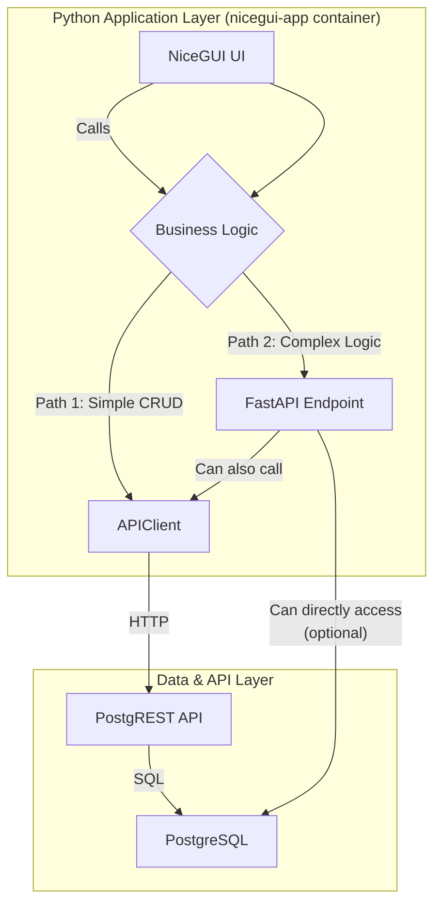

# NiceGUI Application Architecture Philosophy

```mermaid
graph TD
    subgraph "Python Application Layer (nicegui-app container)"
        A[NiceGUI UI] -- Calls --> B{Business Logic}
        B -- "Path 1: Simple CRUD" --> C[APIClient]
        B -- "Path 2: Complex Logic" --> D[FastAPI Endpoint]
    end

    subgraph "Data & API Layer"
        C -- HTTP --> E[PostgREST API]
        D -- "Can also call" --> C
        E -- SQL --> F[PostgreSQL]
        D -- "Can directly access <br> (optional)" --> F
    end

    A --> B
```