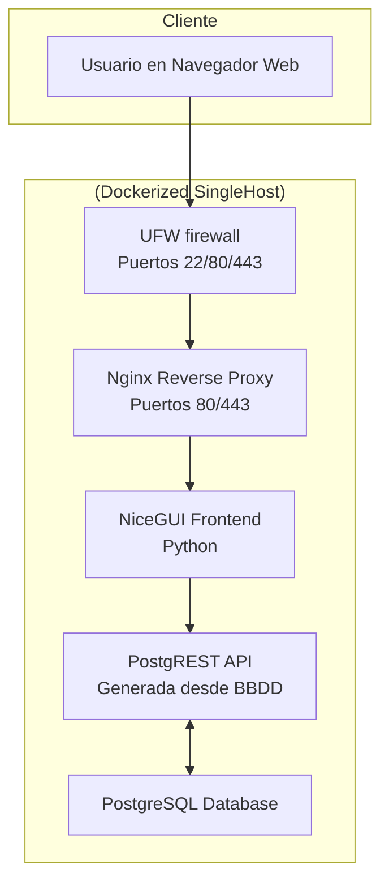

-----

# Sistema de Gestión para el Sindicato de Inquilinas de Madrid

Este proyecto es una aplicación web de escritorio desarrollada para facilitar la gestión interna de la información del **Sindicato de Inquilinas e Inquilinos de Madrid**. La interfaz, construida con **NiceGUI**, ofrece una experiencia de usuario rápida y reactiva para interactuar con una base de datos PostgreSQL a través de una API RESTful generada automáticamente con **PostgREST**.

## 🏛️ Arquitectura

El sistema sigue una arquitectura de tres capas, completamente dockerizada para garantizar la portabilidad y facilidad en el despliegue. Esta elección pragmática está optimizada para la máxima productividad de equipos pequeños.



  * **Capa de Datos (PostgreSQL):** Una base de datos relacional robusta que actúa como la única fuente de verdad. La lógica de negocio, como la sincronización de nodos, se implementa directamente en la BBDD mediante triggers y vistas para centralizar la lógica.
  * **Capa de API (PostgREST):** En lugar de escribir un backend manualmente, PostgREST genera una API RESTful directamente desde el esquema de la base de datos. Esto elimina meses de trabajo de desarrollo, reduce la superficie de errores y garantiza un alto rendimiento.
  * **Capa de Presentación (NiceGUI):** Un framework de Python que permite construir la interfaz de usuario de forma rápida y eficiente, sin necesidad de escribir JavaScript, HTML o CSS por separado.

## ⭐ Características Principales

La aplicación se organiza en módulos funcionales clave, accesibles según los roles de usuario asignados.

### 1\. **Administración de BBDD (`ADMIN BBDD`)**

  * **Gestión CRUD Completa:** Permite crear, leer, actualizar y eliminar registros en cualquiera de las tablas de la base de datos.
  * **Relaciones Inteligentes:** Facilita la asignación de registros relacionados mediante menús desplegables para claves foráneas.
  * **Vista de Detalles Relacionados:** Al hacer clic en una fila, se expande una vista con los registros de las tablas "hijas" asociadas.
  * **Importación y Exportación:** Soporte para exportar datos a **CSV** e importar nuevos registros desde archivos CSV.

### 2\. **Explorador de Vistas (`VISTAS`)**

  * **Visualización de Datos Agregados:** Ofrece acceso de solo lectura a vistas materializadas de la base de datos, ideales para consultas consolidadas sin riesgo de modificación.
  * **Filtros y Búsqueda Avanzada:** Permite filtrar y buscar datos de forma dinámica en el lado del cliente para un análisis ágil.
  * **Exportación a CSV:** La información consultada en las vistas también puede ser exportada fácilmente.

### 3\. **Gestor de Conflictos (`CONFLICTOS`)**

  * **Módulo Especializado:** Una interfaz diseñada específicamente para el seguimiento detallado de conflictos, con filtros por nodo territorial, estado y búsqueda de texto libre.
  * **Toma de Actas y Seguimiento:** Permite añadir notas, acciones y actualizaciones al historial de un conflicto (`diario_conflictos`).
  * **Edición y Borrado de Notas:** Las entradas del historial pueden ser editadas o eliminadas de forma segura.
  * **Actualización de Estado Automatizada:** Al añadir una nota con el estado **"Cerrado"**, la `fecha_cierre` del conflicto se actualiza automáticamente.

### 4\. **Gestión de Usuarios y Seguridad**

  * **Autenticación Segura:** Sistema de login con credenciales y contraseñas hasheadas con bcrypt.
  * **Control de Acceso Basado en Roles (RBAC):** Los usuarios tienen acceso a diferentes módulos según los roles asignados (`admin`, `gestor`, `sistemas`).
  * **Administración de Usuarios y Roles:** Los administradores pueden crear/editar usuarios, cambiar contraseñas y asignar roles a través de una interfaz dedicada.
  * **Perfil de Usuario:** Cada usuario puede ver y editar su propia información personal y cambiar su contraseña.

## 🚀 Tecnologías Utilizadas

| Componente           | Tecnología                                         | Propósito                                                 |
| -------------------- | -------------------------------------------------- | --------------------------------------------------------- |
| **Frontend**         | [NiceGUI](https://nicegui.io/) (basado en FastAPI) | Interfaz de usuario web rápida y reactiva en Python.      |
| **API**              | [PostgREST](http://postgrest.org/)                 | Generación automática de API RESTful desde la BBDD.       |
| **Base de Datos**    | PostgreSQL                                         | Almacenamiento de datos relacional y fuente de verdad.    |
| **Contenerización**  | Docker y Docker Compose                            | Orquestación de servicios para portabilidad y despliegue. |
| **Proxy Inverso**    | Nginx                                              | Punto de entrada único, terminación SSL y seguridad.      |
| **Certificados SSL** | Let's Encrypt con Certbot                          | Cifrado HTTPS gratuito y automatizado.                    |
| **DNS Dinámico**     | DuckDNS                                            | Gestión de dominio para el certificado SSL.               |
| **Unix Firewall**    | UFW                                                | Firewall Unix denegando acceso por defecto.               |

## 🛠️ Despliegue y Ejecución

### Prerrequisitos

  * Docker y Docker Compose instalados.
  * Git.
  * Un dominio de DuckDNS con su token correspondiente.

### Instalación y Puesta en Marcha (Producción Segura)

Este proceso describe el despliegue completo en un único host con SSL.

1.  **Clonar el repositorio:**

    ```bash
    git clone https://github.com/maiktreya/tenantsUnion.git
    cd tenantsUnion
    ```

2.  **Configurar las variables de entorno:**
    Crea una copia del archivo `.env.example` y renómbrala a `.env`. **Ajusta los siguientes valores**:

    ```dotenv
    # Credenciales de la base de datos (puedes dejarlas o cambiarlas)
    POSTGRES_USER=usuario
    POSTGRES_PASSWORD=user_pass
    POSTGRES_DB=your_db

    # Secreto para la sesión de NiceGUI (¡cambia esto!)
    NICEGUI_STORAGE_SECRET=un-secreto-muy-largo-y-seguro-aqui

    # --- CONFIGURACIÓN SSL OBLIGATORIA ---
    # Tu dominio de DuckDNS
    HOSTNAME=tu-dominio.duckdns.org
    # Tu token de DuckDNS
    DUCKDNS_TOKEN=tu-token-de-duckdns
    # Tu email para las notificaciones de Let's Encrypt
    EMAIL=tu-email@ejemplo.com
    ```

3.  **Ejecutar el script de configuración inicial de SSL:**
    Este script automatiza la obtención de certificados SSL. **Solo necesitas ejecutarlo la primera vez.**

    ```bash
    chmod +x utils/init-letsencrypt.sh
    ./utils/init-letsencrypt.sh
    ```

    El script iniciará temporalmente Nginx, solicitará los certificados reales usando el desafío DNS-01 de DuckDNS y reiniciará Nginx con la configuración segura.

4.  **Levantar todos los servicios:**
    Una vez que los certificados han sido generados, levanta la aplicación completa.

    ```bash
    docker compose --profile Secured --profile Frontend up -d
    ```

5.  **Configurar el Firewall (Recomendado):**
    Para mayor seguridad, configura el firewall para permitir únicamente el tráfico necesario.

    ```bash
    chmod +x utils/setup_firewall.sh
    sudo ./utils/setup_firewall.sh
    ```

¡Y listo\! La aplicación estará disponible en `https://tu-dominio.duckdns.org`.

### Operaciones Comunes

  * **Ver los logs de los servicios:**
    ```bash
    # Ver logs de todos los servicios
    docker compose logs -f

    # Ver logs de un servicio específico (ej. nicegui-app)
    docker compose logs -f nicegui-app
    ```
  * **Detener la aplicación:**
    ```bash
    docker compose down
    ```
  * **Actualizar la aplicación (tras un `git pull`):**
    ```bash
    docker compose --profile Secured --profile Frontend up -d --build
    ```
  * **Renovación manual de certificados SSL:**
    La renovación es automática, pero puedes forzarla con:
    ```bash
    chmod +x utils/renew_certificates.sh
    ./utils/renew_certificates.sh
    ```

## 🔐 Seguridad

  * **Proxy Inverso:** Nginx actúa como el único punto de entrada, ocultando los servicios de la aplicación de la exposición directa a internet.
  * **Tráfico Cifrado:** Todo el tráfico entre el cliente y el servidor está cifrado mediante HTTPS, con certificados SSL de Let's Encrypt gestionados automáticamente.
  * **Firewall:** El script `setup_firewall.sh` configura `ufw` para restringir el acceso a los puertos, permitiendo solo SSH (22), HTTP (80) y HTTPS (443).
  * **Contraseñas Seguras:** Las contraseñas de los usuarios se almacenan hasheadas utilizando el algoritmo bcrypt.

## 🗺️ Hoja de Ruta (Roadmap)

Planes de mejora y futuras implementaciones:

  * **Entorno de Pruebas Completo:** Desarrollar una suite de testing exhaustiva.
  * **Revisión de Permisos en BBDD:** Auditar y granularizar los permisos a nivel de base de datos en PostgreSQL.
  * **Generación de Datos de Prueba:** Crear un sistema para poblar la base de datos con datos artificiales para facilitar las pruebas.
  * **Sistema de Logging Mejorado:** Implementar un sistema de logs más detallado y estructurado para los microservicios.