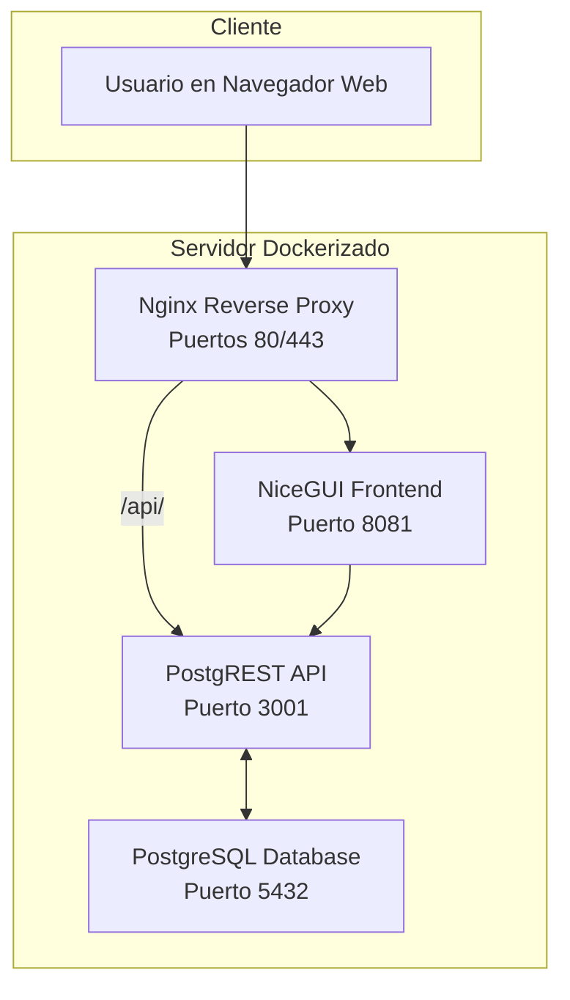

-----

# Sistema de Gestión para el Sindicato de Inquilinas de Madrid

Este proyecto es una aplicación web de escritorio desarrollada para facilitar la gestión interna de la información del **Sindicato de Inquilinas e Inquilinos de Madrid**. La interfaz, construida con **NiceGUI**, ofrece una experiencia de usuario rápida y reactiva para interactuar con una base de datos PostgreSQL a través de una API RESTful generada con **PostgREST**.

## 🏛️ Arquitectura

El sistema sigue una arquitectura de tres capas, completamente dockerizada para garantizar la portabilidad y facilidad en el despliegue.



## 📋 Características Principales

La aplicación se organiza en módulos funcionales clave, accesibles según los roles de usuario:

### 1\. **Administración de BBDD (`ADMIN BBDD`)**

  - **Gestión CRUD Completa**: Permite crear, leer, actualizar y eliminar registros en cualquiera de las tablas de la base de datos.
  - **Relaciones Inteligentes**: Facilita la asignación de registros relacionados mediante menús desplegables para claves foráneas (p. ej., asignar una `afiliada` a un `conflicto`).
  - **Vista de Detalles Relacionados**: Al hacer clic en una fila, se expande una vista con los registros de las tablas "hijas" asociadas.
  - **Importación y Exportación**: Soporte para exportar datos a **CSV** e importar nuevos registros desde archivos CSV.

### 2\. **Explorador de Vistas (`VISTAS`)**

  - **Visualización de Datos Agregados**: Ofrece acceso de solo lectura a vistas materializadas de la base de datos, ideales para consultas consolidadas sin riesgo de modificación.
  - **Filtros y Búsqueda Avanzada**: Permite filtrar y buscar datos de forma dinámica en el lado del cliente para un análisis ágil.
  - **Exportación a CSV**: La información consultada en las vistas también puede ser exportada fácilmente.

### 3\. **Gestor de Conflictos (`CONFLICTOS`)**

  - **Módulo Especializado**: Una interfaz diseñada específicamente para el seguimiento detallado de conflictos.
  - **Toma de Actas y Seguimiento**: Permite añadir notas, acciones y actualizaciones al historial de un conflicto (`diario_conflictos`).
  - **Edición y Borrado de Notas**: Las entradas del historial pueden ser editadas o eliminadas de forma segura.
  - **Actualización de Estado Automatizada**: Al añadir una nota con el estado **"Cerrado"**, la `fecha_cierre` del conflicto se actualiza automáticamente.

### 4\. **Gestión de Usuarios y Roles**

  - **Autenticación Segura**: Sistema de login con credenciales y contraseñas hasheadas.
  - **Control de Acceso Basado en Roles (RBAC)**: Los usuarios tienen acceso a diferentes módulos y funcionalidades según los roles asignados (`admin`, `gestor`, `sistemas`).
  - **Administración de Usuarios**: Los administradores pueden crear, editar y asignar roles a los usuarios del sistema.
  - **Perfil de Usuario**: Cada usuario puede ver y editar su propia información personal y cambiar su contraseña.

## 🚀 Tecnologías Utilizadas

  - **Frontend**: [NiceGUI](https://nicegui.io/) (basado en FastAPI)
  - **API**: [PostgREST](http://postgrest.org/)
  - **Base de Datos**: PostgreSQL
  - **Contenerización**: Docker y Docker Compose
  - **Proxy Inverso y SSL**: Nginx con Certbot para Let's Encrypt

## 🛠️ Cómo Ejecutar la Aplicación

### Prerrequisitos

  - Docker y Docker Compose instalados.
  - Git.
  - Un nombre de dominio (si se desea configurar SSL con Nginx).

### Instalación y Puesta en Marcha

1.  **Clonar el repositorio**:

    ```bash
    git clone https://github.com/maiktreya/tenantsUnion.git
    cd tenantsUnion
    ```

2.  **Configurar las variables de entorno**:
    Crea una copia del archivo `.env.example` y renómbrala a `.env`. Ajusta las credenciales de la base de datos y el `NICEGUI_STORAGE_SECRET`.

3.  **Levantar los servicios con Docker Compose**:
    Existen varios perfiles para levantar la aplicación según tus necesidades:

      - **Modo Producción (con Nginx y SSL)**:

        ```bash
        # Primero, genera los certificados SSL (ejecutar solo la primera vez)
        # Reemplaza 'tu-dominio.com' y 'tu-email@ejemplo.com'
        ./build/nginx/init-letsencrypt.sh tu-dominio.com tu-email@ejemplo.com

        # Levanta todos los servicios, incluyendo Nginx
        docker compose --profile Secured --profile Frontend up -d
        ```

      - **Modo Desarrollo (solo Backend y Frontend)**:
        Este modo es ideal para desarrollar, ya que expone los puertos directamente.

        ```bash
        docker compose --profile Frontend up -d
        ```

        La aplicación estará disponible en `http://localhost:8081`.

      - **Desarrollo "Live" del Frontend**:
        Si prefieres editar el código del frontend y ver los cambios al instante sin reconstruir la imagen de Docker:

        ```bash
        # 1. Levanta solo el backend (DB y API)
        docker compose up -d db server

        # 2. Instala las dependencias de Python en tu entorno local
        pip install -r requirements.txt

        # 3. Ejecuta la aplicación de NiceGUI directamente
        python build/niceGUI/main.py
        ```

4.  **Acceder a la aplicación**:
    Abre tu navegador y ve a `http://localhost:8081` (o a tu dominio si usas Nginx).