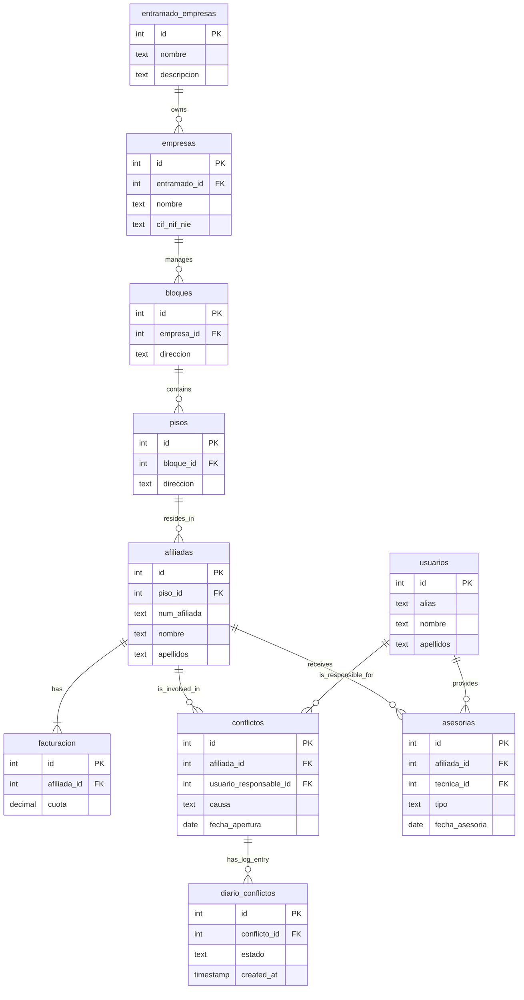

Of course. My apologies, the immersive view can sometimes be tricky for copying. Here is the complete documentation in a raw Markdown block that you can easily copy and paste.

# Sindicato Inquilinos - Database Documentation

This document provides an overview of the PostgreSQL database structure, setup, and design for the Sindicato de Inquilinas project.

## 1. Project Overview

This project sets up a PostgreSQL database using Docker to manage information related to a tenants' union. The database stores data about members (`afiliadas`), corporate structures (`empresas`, `entramado_empresas`), properties (`bloques`, `pisos`), union staff (`usuarios`), and key activities like legal conflicts (`conflictos`) and consultations (`asesorias`).

The system is designed to be deployed via `docker-compose`, which initializes the database, populates it from a series of CSV files, and then creates a set of materialized views to serve as simplified API endpoints.

---

## 2. Entity-Relationship Diagram (ERD)

This diagram illustrates the relationships between the main tables in the final, improved database schema. Note the removal of redundant name fields in `conflictos` and `asesorias`.

## 3. API Endpoints (Materialized Views)
To provide stable, performant, and easy-to-use endpoints for the PostgREST API, the database uses a set of materialized views. These views denormalize the data by joining the core tables, effectively reconstructing the original CSV files or providing useful aggregations.

- v_afiliadas: Replicates the structure of the main Afiliadas.csv file by joining afiliadas, facturacion, pisos, bloques, and empresas. This view provides a complete, flat profile for each member.

- v_empresas: Replicates Empresas.csv and adds a calculated count of members (Núm.Afiliadas) associated with each company. This is useful for high-level reporting.

- v_bloques: Replicates Bloques.csv and, similar to v_empresas, adds a calculated count of members (Núm.Afiliadas) for each property block.

## 4. Database Design Analysis
Here is an analysis of the final database schema, highlighting its strengths and areas for potential future improvement.

### Strengths
Excellent Normalization (3NF): The structure is well-normalized. Distinct entities are correctly separated into their own tables, and redundant data has been eliminated. This reduces data redundancy and improves data integrity.

Robust Referential Integrity: The use of foreign keys correctly establishes relationships. Key relationships now use ON DELETE CASCADE where appropriate to ensure that deleting a parent record cleanly removes dependent child records, preventing orphaned data.

Performant by Design: Indexes have been added to all foreign key columns. This is a critical best practice that ensures high performance for queries that join tables or filter on these keys, which is essential as the dataset grows. The use of materialized views further enhances read performance for the API, as the complex joins are pre-calculated.

Clear Naming Conventions: The table and column names are clear, in Spanish, and generally easy to understand, which makes the schema highly maintainable.

Reliable Staging Process: The use of staging tables provides a robust buffer for importing data from external CSVs, allowing for data cleaning and transformation before loading into the final, normalized tables.

### Areas for Future Improvement
While the current design is very solid, here are some potential next steps to consider as the project evolves:

Data Type Specificity:

Issue: Many columns are still defined as TEXT. While flexible, this doesn't provide the same level of data validation as more specific types. Columns like estado, genero, forma_pago, and regimen likely have a limited set of valid values.

Recommendation: For a future version, consider using the ENUM type for these columns to enforce data integrity at the database level (e.g., CREATE TYPE tipo_estado AS ENUM ('Abierto', 'Cerrado', 'Pendiente');). This makes the data more reliable and can be more space-efficient.

User Roles and Permissions:

Issue: The usuarios table has a roles column of type TEXT. This is functional but not ideal for managing complex permissions.

Recommendation: A more scalable approach would be to create separate roles and permissions tables, with a junction table (usuario_roles) to link users to one or more roles. This provides a much more flexible and powerful security model.

View Refresh Strategy:

Issue: Materialized views are not updated automatically. They need to be refreshed to reflect changes in the underlying tables.

Recommendation: Implement a refresh strategy for the materialized views. This can be done via a cron job or a database trigger that runs REFRESH MATERIALIZED VIEW view_name; periodically or after data modifications.

## Conclusion
The database design is excellent, robust, and follows professional best practices. It is well-normalized, indexed for performance, and uses materialized views effectively for API consumption. The recommendations above are strategic improvements to consider for future versions as the application's complexity grows. You have built a very solid and maintainable foundation.